# Case Map Generation Toolset

> last updated 2026.08.11

## Summary
The Case Map Generation toolset is a collection of Python-based ArcGIS Pro scripts. These scripts have been configured in the default toolbox of the ArcGIS Pro project CaseMap.aprx. The case map tool is used to generate informative, pre-configured maps by allowing the user to specify one or more GPINs to describe the map’s region of focus, as well as descriptive text, the map type, and scale. A pre-set layout corresponding to the selected map type parameter is then updated according to the user input.
The Save Project for Review tool saves the active project to the Monthly Case Files folder, using the case number as the project filename.
After the version of the project saved to the Monthly Case Map Files folder is reviewed and accepted, the Finalize Project tool analyzes the case number to retrieve the case year and case type. A final version of the project is then saved within a folder named for the case type. This case type folder is located within a folder named for the case year, which is itself located within the Case Maps folder.

## Description
The contents of this repo are maintained by the Hanover IT CD/GIS Team and utilized by the Hanover Planning Department to design and generate various maps using a consistent format. The essential component of this module is an ArcGIS Pro project named CaseMap.aprx.
The project includes a toolbox called CaseMap.tbx. This toolbox contains three scripts, Generate Case Map, Save Project for Review, and Finalize Project. When the Generate Case Map tool is opened in ArcPro, the user can set the parameters needed to generate the desired map, including the parcel GPINs, Case Number, descriptive text, map scale and map type. The Save Project for Review tool consolidates all the layers used in the project map set into a single file geodatabase and saves a copy of that geodatabase along with the project itself to the Monthly Case Files folder on the G: drive. The Finalize Project tool is used after the version of the project in the Monthly Case Files folder has been finalized. This tool saves the final project to a folder named for the case type. This case type folder is located within a folder named for the case year, which is itself located within the Case Maps folder. 

## Dependencies

#### Project Dependencies
 - ArcGIS Pro 3.5+
 - Python 3.7.11 and libraries installed with ArcGIS Pro 2.9+

#### Data Access
This module requires *.sde connection files to the GISHANOVER and GISGEN geodatabases with operating system authentication. These files are provided in the connections folder in the repo.

## Outputs
The feature classes below are copied into the user's local repo:
  
- GISHANOVER.LAND_RECORDS.Parcels_with_Data 
- GISHANOVER.PLANIMETRICS.BUILDINGS 
- GISHANOVER.PLANNING.Overlay_Historical 
- GISHANOVER.REGISTRAR.MAGISTERIAL_DISTRICTS 
- GISHANOVER.PLANNING.Zoning 
- GISHANOVER.PLANNING.LandUse 
- GISHANOVER.PLANNING.Conditional_Use_Permits 
- GISHANOVER.PLANIMETRICS.TREES 
- GISHANOVER.WATER.STREAMS 
- GISGEN.GIS_OFFICE.STREET_CENTERLINE_DATASET\\GISGEN.GIS_OFFICE.STREET_CENTERLINES 
- GISGEN.GIS_OFFICE.COUNTY_BOUNDARY_DATASET\\GISGEN.GIS_OFFICE.COUNTY_BOUNDARY

## Usage
### Setup Instructions
Open the project `CaseMap.aprx` and verify that ArcGIS Pro is not set to remove layers that reference data overwritten by geoprocessing tools. This setting can be found by clicking the Project tab:
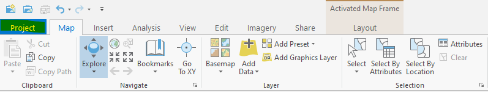

And accessing 'Options'.

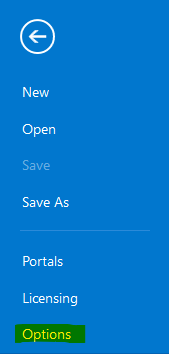

Uncheck 'Remove layers that reference data overwritten by geoprocessing tools' in the Geoprocessing menu under the Application section.

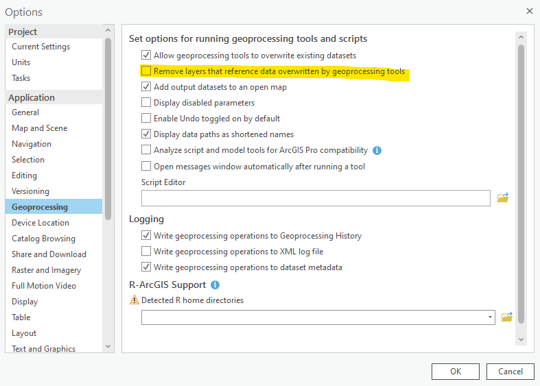

### Case Map Tool
#### Enter Parameters
Open the Case Map Tool in the CaseMap toolbox:

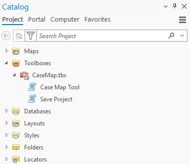

And enter the parameters. Required parameters are marked with a red asterisk *.

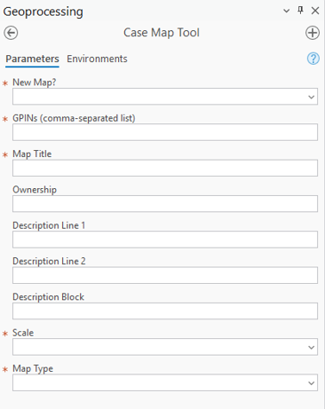

The parameters "GPINs", "Map Title", "Ownership", "Description Line 1", Description Line 2", and "Description Block" will change the text on all map layouts (although the description block text is hidden in all of them, except the Comp Plan layout).  The scale parameter only affects the zoom level of the selected map type layout.

If “Yes” is chosen for the “New Map?” parameter, all the ‘dynamic’ data displayed in the project maps will be copied down from the Hanover County Enterprise system and saved in a file geodatabase named for the date (yyyymmdd.gdb). You can choose whether to also refresh the ‘static’ data in the file geodatabase “staticdata.gdb” that is also displayed in these maps. The descriptors ‘dynamic’ and ‘static’ are used to differentiate between layers that change frequently, such as parcel polygons and conditional use permits, and those that are relatively stable, such as waterways and official boundaries.

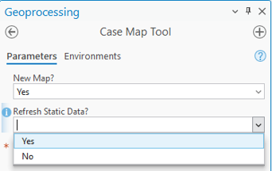

You can also choose to pull data from an existing local file geodatabase, if the tool has already been run before, and the data does not need to be updated from Enterprise again. Choose “No” for the “New Map?” parameter and select the date that the data was copied. Note that both the ‘Date And Time’ and the ‘Date’ options will work for this parameter. Time only will not work.

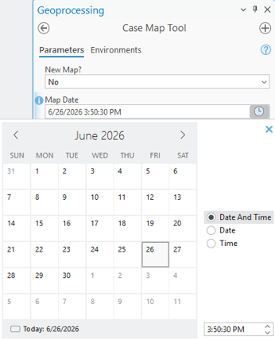

Note that if no file geodatabase for the selected date exists, an error will be triggered, and you will not be able to run the tool until a valid date is selected.

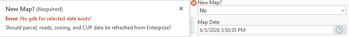

##### GPINs
Enter a list of the GPINs that need to be highlighted in the map. This can be a single GPIN in XXXX-XX-XXXX format, or a comma-separated list of GPINs in XXXX-XX-XXXX format. The parcels named in this list will be pulled from the GIS parcels data and then merged to create a polygon feature class called “tempparcels”. The value of the list itself will be written to the field “GPINs” in the “tempparcels” attribute table. This field will be used to source the dynamic text in the layout.

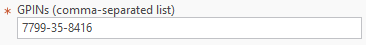

##### Title
The Map Title parameter will most often be the case number – for example, REZ2026-00021. There is a 17-character limit on this line. This value is then written to the field “title” in the “tempparcels” attribute table and used to source the dynamic text in the layout.

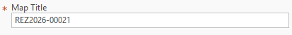

##### Ownership
The Ownership parameter allows you to enter in the name(s) of any property owners or other stakeholders involved in the case. There is a 120-character limit on this parameter. This value is then written to the field “owners” in the “tempparcels” attribute table and used to source the dynamic text in the layout.

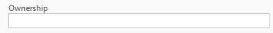

##### Descriptions
The tool allows for two single lines of descriptive text and one longer text block. There is a 30-character limit on each line and a 100-character limit on the text block.  These values are then written to the fields “desc1”, “desc2”, and “desc3” in the “tempparcels” attribute table and used to source the dynamic text in the layout. By default, the larger text block is only visible in the Comp Plan map layout.

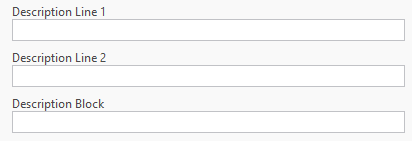

##### Scale
Choose the map scale. The script will create a point feature on the center of the selected GPINs, buffer that point according to the selected scale, and zoom to the extent of that buffer area. This center point feature is also used to identify the underlying magisterial district. This value is then written to the field “magdist” in the “tempparcels” attribute table and used to source the dynamic text in the layout. This parameter will affect the selected map type only.

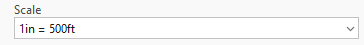

##### Map Type
Choose the map type. There is a map in the Maps folder and a layout in the Layouts folder to correspond to each map type choice. The layers in the corresponding map will be re-sourced to the dated file geodatabase selected earlier. The text in the corresponding layout will be configured to pull from the updated fields in the “tempparcels” attribute table.

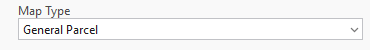   

#### Run the Script and Check Output
When all required parameters have been completed, click “Run”. A green checkmark will appear when the script has completed successfully.

  

Open the layout for the map type selected earlier – in this case, General Parcel – and make sure everything appears as expected.

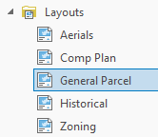

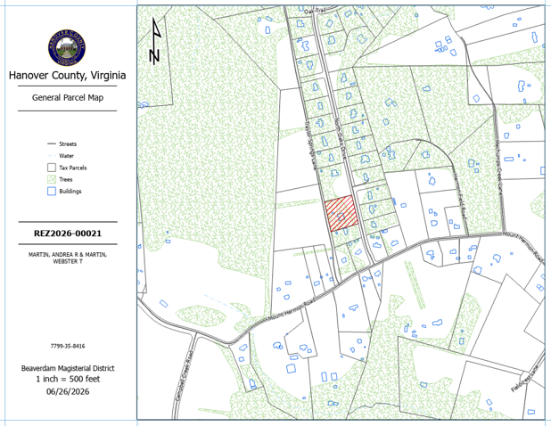     

Sometimes, the application might ‘hang’ and some layers might not show up immediately after the tool is run. This can usually be fixed by reloading the layout. The reload tool is located in the bottom right corner of the layout pane.

     

#### Add Contextual Elements
You might need to enter extra text or additional shapes such as circles to highlight portions of the map. If the current layout needs additional map elements, open the Insert tab and select the Graphics and Text tool.

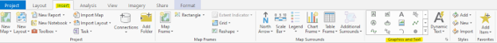

Note that if this option is not available if the map frame of the layout is active. If the map frame is active, you can close the activation by using the Close Activation tool in the Layout tab.

To add text to the layout, select the Straight text option.

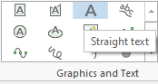

The Element pane will open next to the map layout window. Type the desired text here.

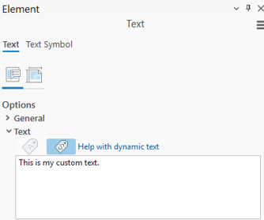   

The new text will be displayed in the map. The layer itself in the table of contents is still called “Text”, but you can easily change this by clicking the layer once in the table of contents and entering a custom layer name.

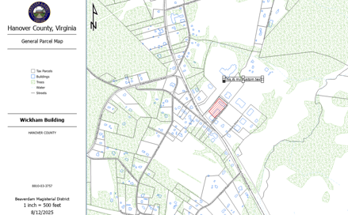    

To change the appearance of the text on the map, open the Text Symbol tab in the Element pane. There are several options for changing the appearance of the text symbol available here. For example, font, text size, and text color options are available under the Appearance menu. Experiment with these formatting options until the text displays as desired. When finished, click Apply.

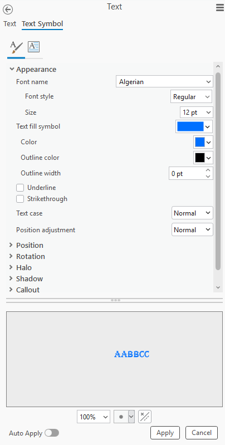 

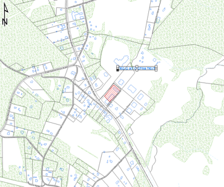 

Shape options are also available in the Graphics and Text tool.

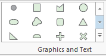 

Choose a shape element from the Graphics and Text tool and click anywhere on the map to add it. The Element pane will open. Scale the shape as needed using the corner anchors and move the shape by clicking and dragging.

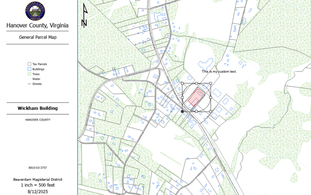

Repeat these steps for any of the remaining map types needed for the case. When each layout option has been configured as needed, you will need to ‘freeze’ the project in time and disconnect it from the dated geodatabase by saving a copy of the project and all its underlying data to another location. The original project is intended to serve as a template that can be used to customize the maps needed to display information about an individual case. When the customization of the maps for the case is complete, that copy of the project is saved separately, without altering the template. This way, the various dated layers and custom additional elements in the layouts for the case are saved only to a version of the project that is specific to the case, and the template itself remains unchanged.

#### Save Individual Maps
To save one of the map layouts, (for example, as a .pdf or .jpg file) open the map type layout for the map you’d like to save. Navigate to the Share menu and click the Export Layout tool in the toolbar.

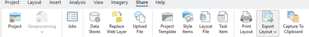

Several Export Presets are available. The one you select from this window isn’t terribly important - the file type of the saved image can be re-configured in the next step, before the file is saved, using the ‘File Type’ drop-down menu. In this example, ‘Web JPEG’ has been chosen.

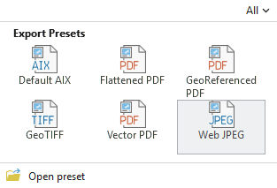

The Export Layout window will appear. Make sure the desired file type is selected in the File Type drop-down menu. Specify a folder path and filename for the saved file in the Name parameter. The other settings here can be left on their default values. Click Export to save the map to the specified location.

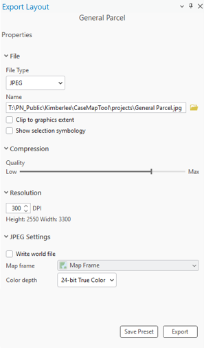

### Save Project for Review Tool
Once all the maps for the case have been created and customized, you’re ready to save the project to the Monthly Case Maps folder and disconnect it from the case map tool. To do this, navigate back to the CaseMap toolbox in the project Catalog pane, and open the Save Project for Review tool.

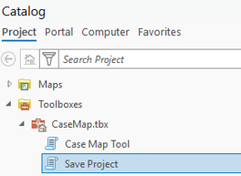

Drag and drop the tempparcels layer from the table of contents of any final layout into the ‘Temp Parcels Layer’ parameter.

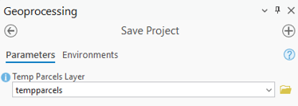

Click ‘Run’ at the bottom of the tool window. The script will now consolidate all the layers used in every map in the projects into one file geodatabase and save that file geodatabase along with the project itself to the Monthly Case Maps folder, using the map title as the new project filename. Note that if a project with this file name already exists in the Monthly Case Files folder, it will be overwritten. 

### Finalize Project Tool

### Tips
#### New Map
If you’re pulling fresh data from Enterprise for a set of new maps, this only needs to be once, for the first map generated. After this, when generating subsequent maps, you can set the New Map? parameter to ‘No’  and select today’s date for the Map Date parameter to pull from the geodatabase already created.

#### Restore Script Parameters
If you have already generated a map with your parameters filled out correctly, and you close out of the tool, all parameters will be reset to blank when you re-open it. This could potentially be very frustrating.

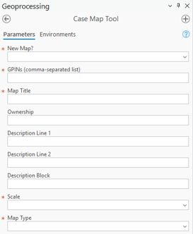

To restore the parameters you already entered, navigate to the Analysis tab and select the History tool.

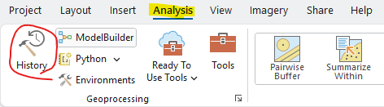 

Double-click the most recent successful Case Map Tool runtime record.

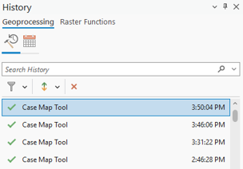

The tool will reload with the same parameters used during that selected runtime. Remember to reset New Map? to ‘No’ if you’ve already created the geodatabase for the map data.

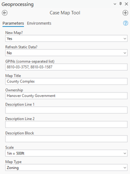

#### Check Data Sources
To make sure the “dynamic” data (parcels, streets, conditional use permits, zoning) shown in a particular map layout  are being sourced from the correct dated geodatabase, open the source map for the layout. For example, ‘Aerials’:

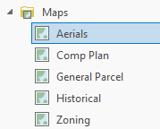  

Switch the table of contents listing style to ‘List By Data Source’

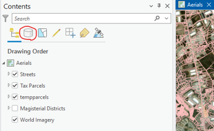

Check to make sure that the correct geodatabase is being used for the dynamic data. This map is using a geodatabase dated July 23, 2026.

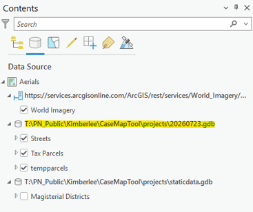  
