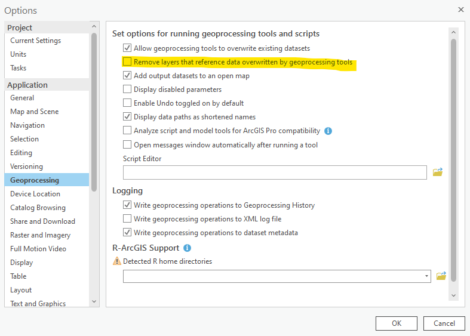
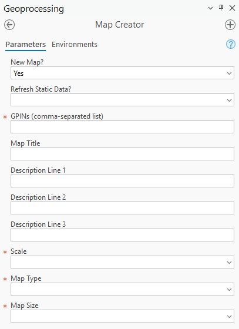

# Generic Map Generation Tool

> last updated 2025.09.23

## Summary
Contains an ArcGIS Pro project consisting of a map, two print layouts, and an arcpy script for generating parcel-centric maps.

## Description
The contents of this repo are maintained by Kristin Dillard, and were initally created for use by the Hanover County GIS department. The essential component of this module is an **ArcGIS Pro** project named `MapCreator.aprx`. 

The project includes a toolbox called `MapCreator.tbx`. This toolbox contains one script called `Map Creator`. When this tool is opened in ArcGIS Pro, the user can set the parameters needed to generate the desired map, including the subject parcel GPINs, a map title, descriptive text, map scale and map type.

## Dependencies

#### Project Dependencies
 - ArcGIS Pro 3.5+
 - Python 3.7.11 and libraries installed with ArcGIS Pro 2.9+

#### Data Access
This module requires Enterprise database `*.sde` connection files or file geodatabase directories containing the source feature classes defined in the configuration .ini files. These should be added to the `connections` folder.

## Outputs

### GIS Data
GIS data layers are classified as either 'static' (seldomly updated layers such as legal county boundaries) or 'dynamic' (periodically updated data such as parcel boundaries).
The map feature classes are sorted into these two categories in the project configuration .ini files.

When a new map is created using the `Map Creator` tool, the 'dynamic' feature classes defined in the project configuration file are copied into a geodatabase named for the date of capture, while the 'static' feature classes are copied into a geodatabase named 'static'.

## Usage

1. Open the project `MapCreator.aprx` and verify that ArcGIS Pro is *not* set to remove layers that reference data overwritten by geoprocessing tools. This setting can be found by clicking the Project tab:

    

    And accessing 'Options'.

    

    Uncheck 'Remove layers that reference data overwritten by geoprocessing tools' in the Geoprocessing menu under the Application section.

    

2. The available map layouts will be listed under the Layouts section of the Catalog pane. Currently, an 8.5x11 and an 11x14 layout are available. The layouts include a map frame and several lines of dynamic text that will change depending on the parameters set in the `Map Creator` script. Upon opening the `MapCreator.aprx` project, the layout will display as it appeared the last time the project was saved.

3. To generate a new map, expand the `Toolboxes` section and double-click `Map Creator`. In the Parameters section of the geoprocessing pane, enter the requested information. Fields marked with an asterisk are required.

    

4. The data layers are pulled into two file geodatabases - one for 'static' data, and the other for 'dynamic' data. The file geodatabase for the dynamic data will be named using the date the data was captured. If the data for the desired map has not already been pulled down into a file geodatabase, select 'Yes' for the 'New Map?' parameter. New data for the dynamic layers will be pulled from the source Enterprise geodatabase or file geodatabase into a new file geodatabase named using today's date. If this is the first time the Map Creator tool has been run, you'll need to select 'Yes' to bring down the static data also. This is also the case if the tool has already been run, but the existing static data needs to be refreshed. If the existing static data can be used as is, select 'No'.
    
    

5. If the data for the desired map has already been generated, select 'No' for the 'New Map?' parameter, and then select the date the existing data was captured so that the tool knows which file geodatabase to pull from. If no file geodatabase for the selected date exists, the 'New Map?' parameter will throw an error, preventing the tool from running.
    
    

6. With at least one parcel GPIN, the map scale, and the map type set in the tool parameters, click Run. The map frame will pan to the desired area and extent, and the dynamic text elements will update with the map title, ownership information, and magisterial district.

7. If the map is ready for export, click the Share tab and select 'Export Layout'.

    

8. In the Properties section of the Export Layout window, set the desired file type, location, and file name of the map. Click Export. The map will be saved to disk.

    

### Add or Remove Layers, Shape and/or Text Elements
1. Sometimes elements need to be added or removed from the map. If the map needs these additional changes, this can be done before exporting the map pdf. Make sure that the map creator tool has already been run so that the map layout is set where you want it. It is best to make a copy of this base layout first, and make these customizations to the copy.  

#### Create a Copy of a Layout
1. Right-click the layout in the Layouts section of the Catalog pane and select 'Copy'.
    
    

2. Next, right-click the Layouts folder in the Catalog pane and select 'Paste'. Name the new layout if desired, and double-click to open it in the project. Be careful not to edit the existing layout templates.

    

#### Remove a Layer
1. To remove a layer from the final map, uncheck the box beside that layer in the table of contents. This does not delete the data, but simply hides it within the final export. 

    
    

#### Add Text
1. To add a text element to the layout, make sure the Map Frame is not active by using the `Close Activation` tool in the `Layout` tab. Now the `Graphics and Text` tool is available under the `Insert` tab.

     

2. Next, select `Straight text` option from the `Graphics and Text` tool.

    

3. Now click anywhere on the map to place the new text element. The text element will be added to the table of contents. By default, this new element is called "Text". To change the text of the element, double-click the layer in the table of contents.

    

4. The `Element` pane will open next to the map layout window. Type the desired text here.

    

    The new text will display in the map. The layer itself in the table of contents is still called `Text`, but you can easily change this by clicking the layer once in the table of contents and entering a custom layer name.
    
    

5. To change the appearance of the text in the map, open the `Text Symbol` tab in the `Element` pane. There are several options for changing the appearance of the text symbol available here.  For example, font, text size, and text color options are available under the `Appearance` menu. Experiment with these formatting options until the text displays as desired. When finished, click Apply.
    
    
    

#### Add Shape Elements
1. There are several shape options available in the `Graphics and Text` tool. 

    

2. Choose a shape element from the `Graphics and Text` tool and click anywhere on the map to add it. The `Element` pane will open. Scale the shape as needed using the corner anchors, and move the shape by clicking and dragging.

    

3. The appearance of the shape can be changed using the options in the Symbol menu of the `Element` pane. Experiment with these formatting options until the shape displays as desired. When finished, click Apply.

    

Note: If you ever forget to click Apply before exiting the formatting pane, a warning message will pop up to remind you.
